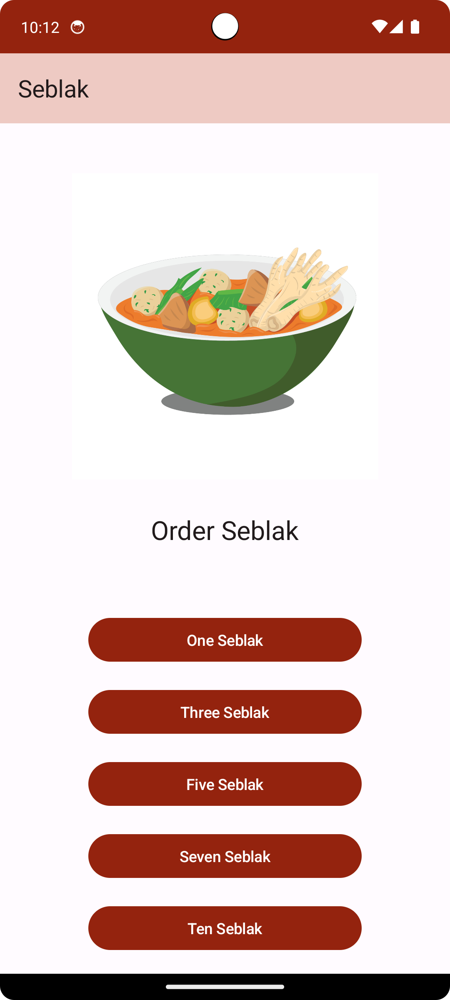
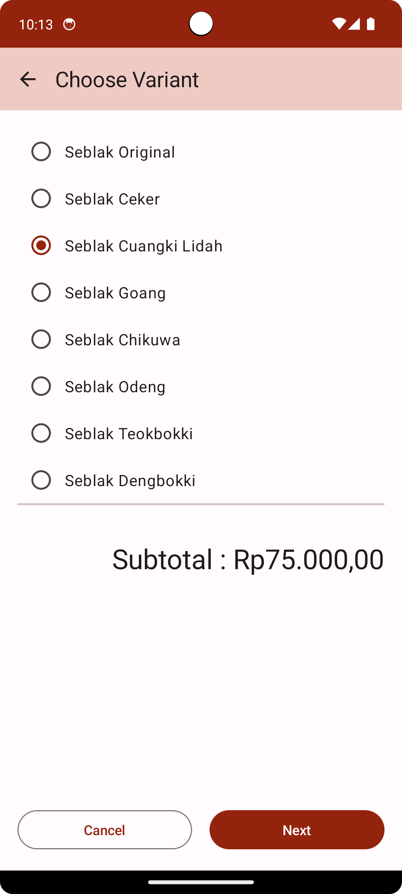
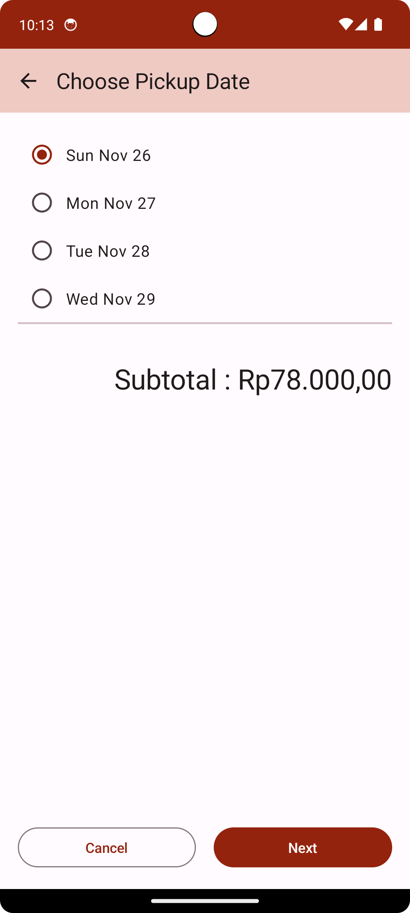
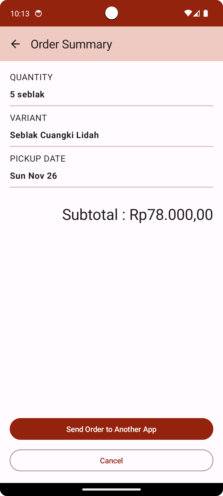
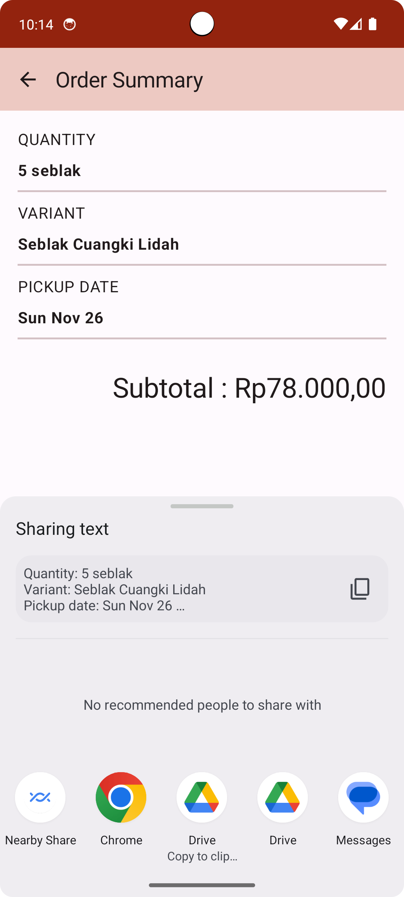

# Seblak
Hai, perkenalkan saya Ika Nurfitriani! Repositori ini merupakan hasil latihan projek kelas dengan referensi berasal dari codelab. Hasil projek berupa projek aplikasi Android yang diberi nama Seblak. Aplikasi ini adalah sebuah aplikasi pemesanan seblak dengan pilihan kuantitas, jenis, dan tanggal pengambilan yang menampilkan detail pesanan dan dapat dibagikan ke aplikasi lain untuk mengirim pesanan.

# Fitur-Fitur
- StartOrderScreen: Aplikasi menampilkan 5 pilihan jumlah seblak yang akan dipesan.
- SelectOptionScreen-Variant: Aplikasi menampilkan 8 pilihan jenis seblak.
- SelectOptionScreen-Pickup: Aplikasi menampilkan 4 pilihan tanggal pengambilan.
- OrderSummaryScreen: Aplikasi menampilkan ringkasan pesanan seblak dan button untuk berbagi ke aplikasi lain.

# Screenshot Aplikasi
Berikut ini adalah hasil screenshot dari aplikasi Seblak:

     

## Author
[@Ika Nurfitriani](https://github.com/ikanurfitriani)