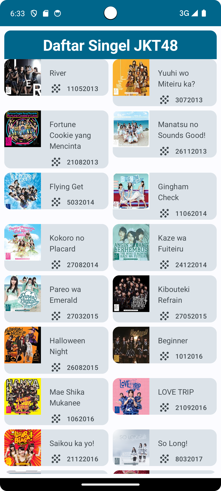
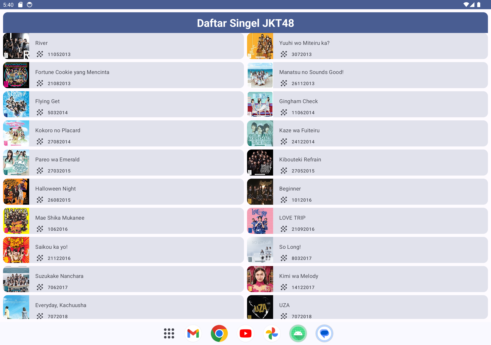

# Singles
Hai, perkenalkan saya Ika Nurfitriani! Repositori ini merupakan hasil latihan projek kelas dengan referensi berasal dari codelab. Hasil projek berupa projek aplikasi Android yang diberi nama Singles. Aplikasi ini menampilkan daftar singel JKT48 beserta informasinya.

# Fitur-Fitur
- Home: Aplikasi menampilkan daftar singel JKT48 dengan poster, judul dan tahun rilis dari singel.

# Screenshot Aplikasi
Berikut ini adalah hasil screenshot dari aplikasi Singles:

 

## Author
[@Ika Nurfitriani](https://github.com/ikanurfitriani)